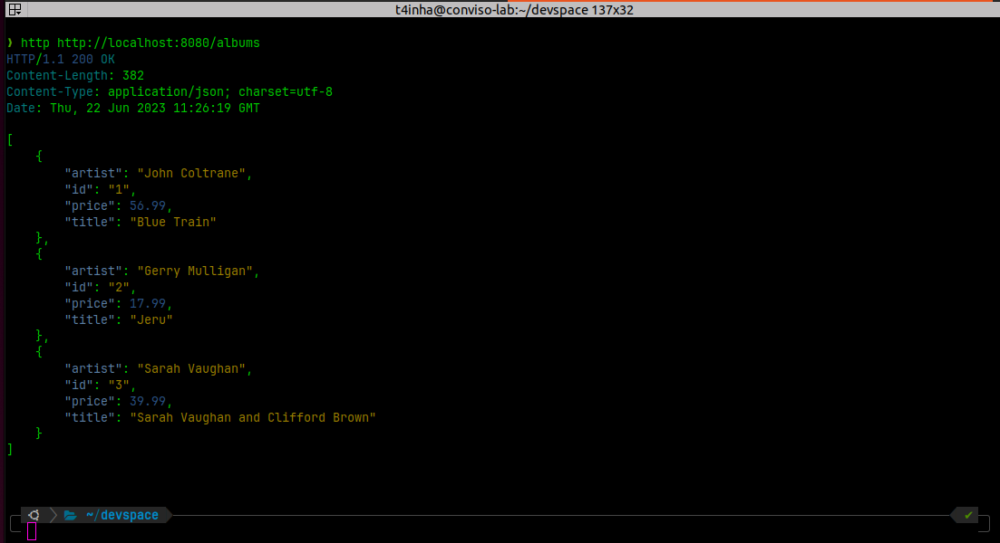
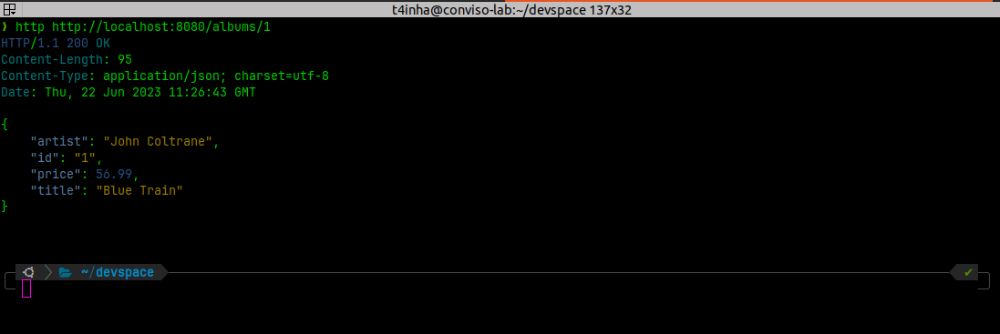
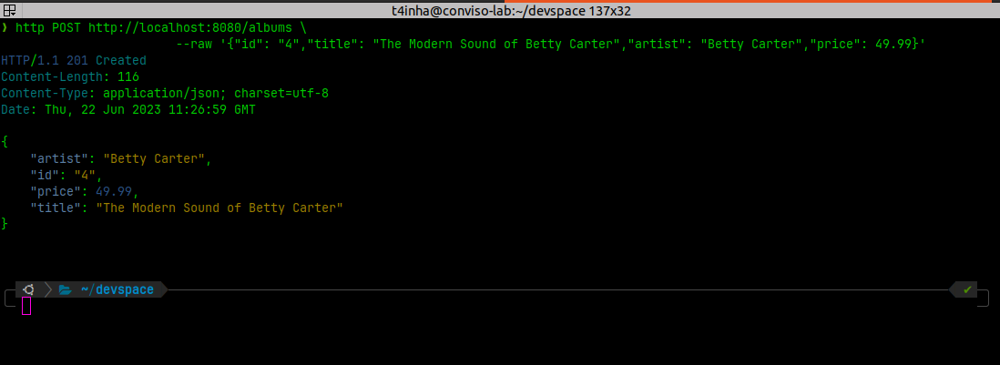

# go-restful-api

* Checkout docs: [docs/index.md](docs/index.md)

## Getting started

```bash
# download repository
git clone git@github.com:andersonbosa/go-restful-api.git

# enter in the package folder
cd go-restful-api/go-restful-api

# install dependencies
go get .

# run the Gin server
go run .
```

### Test the endpoints

> I did use `httpie` in the following snippets. 

#### `GET /albums` 

```bash
http http://localhost:8080/albums
```



#### `GET /albums/:id`

```bash
http http://localhost:8080/albums/2
```



#### `POST /albums`

```bash
http POST http://localhost:8080/albums \
  --raw '{"id": "4","title": "The Modern Sound of Betty Carter","artist": "Betty Carter","price": 49.99}'

```


